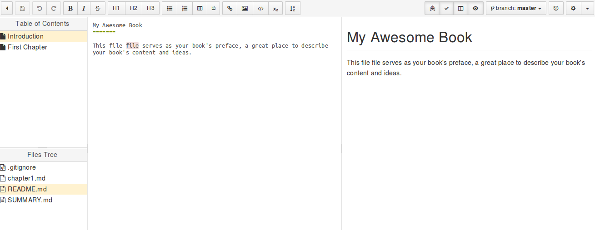
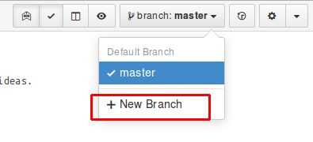
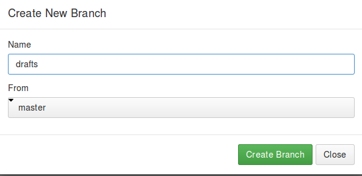

## **1.3. GitBook在线编辑器**
创建好图书，开始写作后，我们进入了GitBook的在线编辑器，这个编辑器分了三个主体部分  
  
1.中间是编辑区域，使用Markdown语法；  
2.左上方是章节目录，鼠标右键可以新增章，在上右键可以新增节，托放可以改变顺序；  
3.左下方是档案列表，鼠标右键可以新增目录或档案。这里面最必要的是```README.md```和```SUMMARY.md```。前者是书籍的简介，后者是真正决定书籍目录结构的，比如多层次目录结构，需要手动修改SUMMARY.md（左上方会立刻呈现效果）。  
4.右侧是预览窗口，可以点击“眼睛图标”关闭/开启预览区域。其实可以关闭左侧区域和右测预览区域，专心写作。  
## **草稿模式**
先不要急于写如文字，我们看到在线编辑器的右上方的**branch:master**按钮，这说明目前编辑模式正处于“主分支”亦“对外发行”模式，在此模式下，无论输入什么，一旦保存，GitB
ook就会立即生成各种版本的电子书对外发布。

大多数人还是不希望读者看到，连一个章节都没有完成的书籍。况且读者一旦订阅，那每发布一次，读者都会收到更新通知，这种体验是不够人性化的。

理想状态是：我们每完成一个章节的内容并确认无误后，才进行发布更新。而在“草稿模式”下，不论我们如何操作，都不会将内容发布出去，除非将“草稿模式”下的所做所为，提交到“发行模式”，那接下来就进入“草稿模式”吧。其实就是在主分支上创建一个分支，点击“**+New Branch**”  
  
在弹出窗口输入**drafts**按下确认，这是编辑器就会从“**发行模式**”切换到“**草稿模式**”了。

