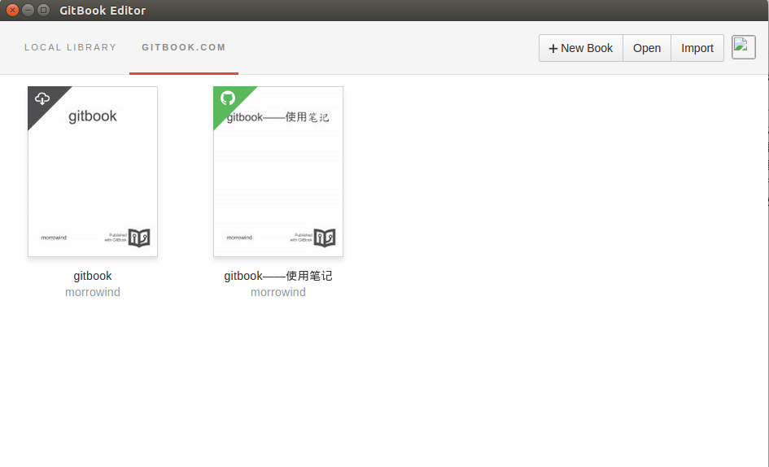
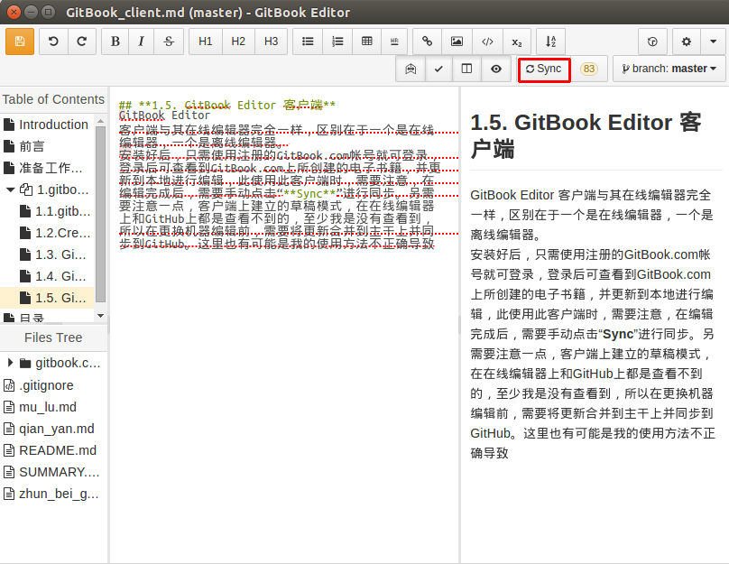

## **1.5. GitBook Editor 客户端**
GitBook Editor 客户端与其在线编辑器完全一样，区别在于一个是在线编辑器，一个是离线编辑器。  
安装好后，只需使用注册的GitBook.com帐号就可登录，登录后可查看到GitBook.com上所创建的电子书籍，并更新到本地进行编辑  

此使用此客户端时，需要注意，在编辑完成后，需要手动点击“**Sync**”进行同步  

另,需要注意一点，客户端上建立的草稿模式，在在线编辑器上和GitHub上都是查看不到的，至少我是没有查看到，所以在更换机器编辑前，需要将更新合并到主干上并同步到GitHub。这里也有可能是我的使用方法不正确导致.
