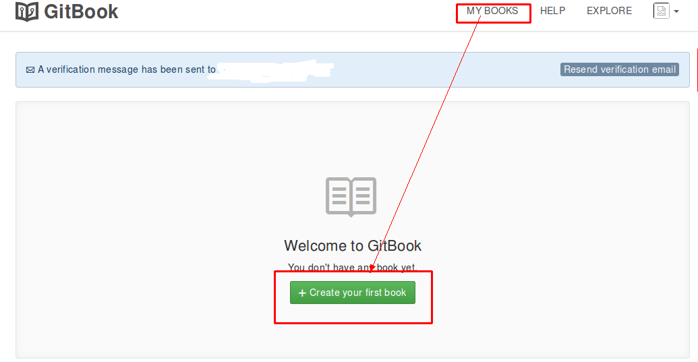
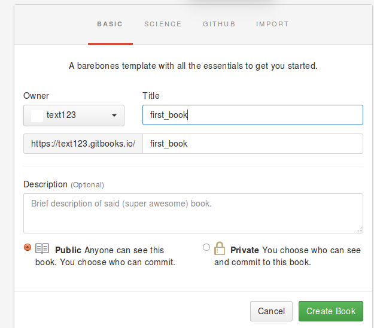

# **1.2 在线创建一本电子书**
完成对帐号的基本设置，就可以创建第一本电子书了。右上角选“MY BOOKS”进入我的图书，在没有图书的时候，看到的画面 图1-6

图1-6

点击“Create your first book”,进入创建页面（图1-7），填写书名、url以及选择公开还是私有，写好信息后，点击“Create book”就创建成功了（一般我们都会选择公开，私有书籍服务需要购买）。

。

图1-7
