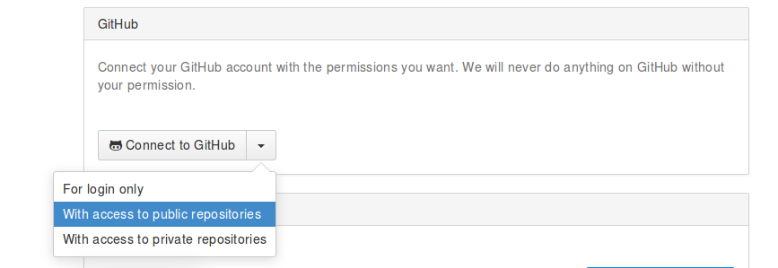
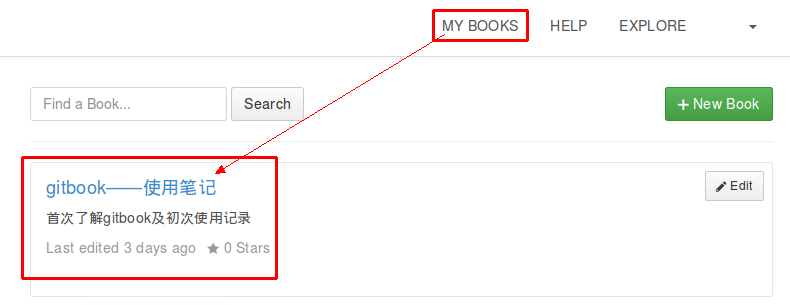
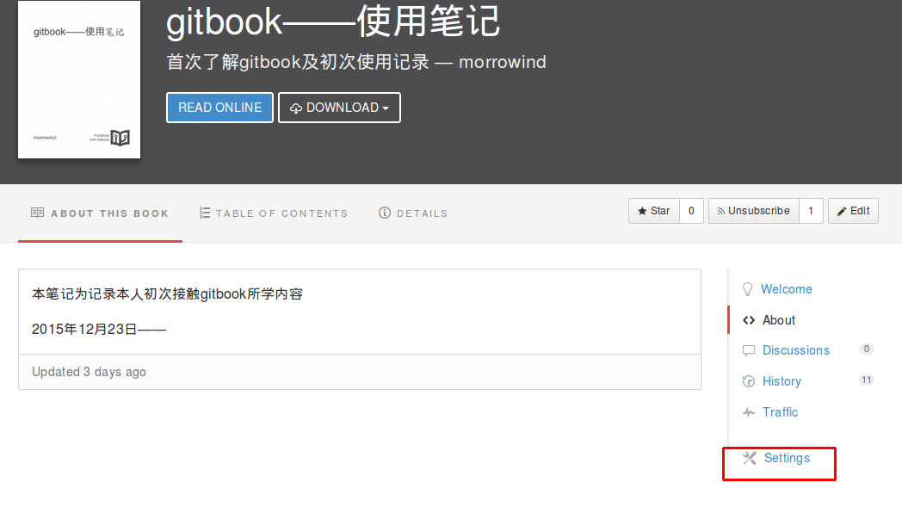
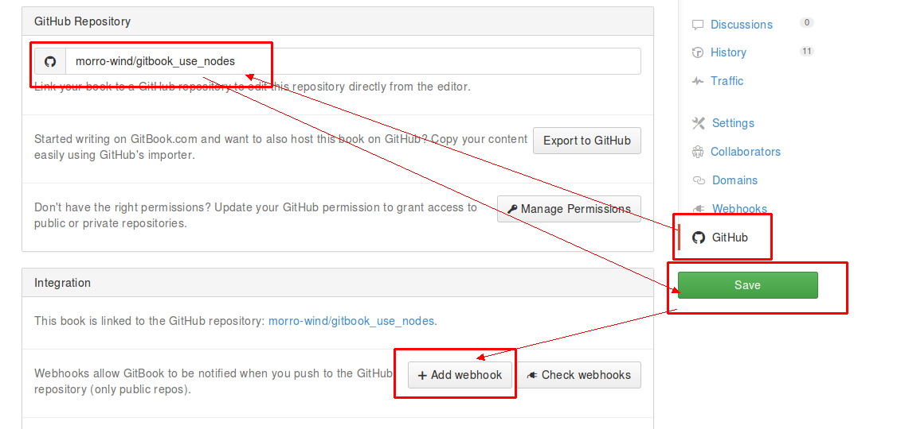

## **1.4. GitHub关联并创建仓库**

如果在注册时没有使用GitHub帐号授权注册，那我们现在就来做与GitHub的帐号关联。  
进入“**Account setting**”找到“Gitub”一项，在下拉项中选择“**With access to public repositories**”,随后会跳转到GitHub登录页面，输入帐号密码登录后看到的页面与前面使用GitHub登录时相同的页面。依照授权登录操作即可。  

  

## **创建电子书GitHub仓库**  

在“**MY BOOKS**”标签页，找到需要创建GitHub仓库的那本电子书，并点击进去  

  

在右侧，点击**setting**，进入电子书设置页面  

找到**GitHub**设置项，点进去，设置电子书对应的GitHub仓库名(没有则在GitHub上创建一个)，保存后再点击**+Add webhook**  

  

如此一来，此后的电子书都将先更新到GitHub上，然后在推送到gitbook上进行发布。

这也方便了无论在什么位置，都可以将GitHub上的电子书拉到本地进行编辑，然后在方便时再将更新提交到GitHub上进行GitBook发布。