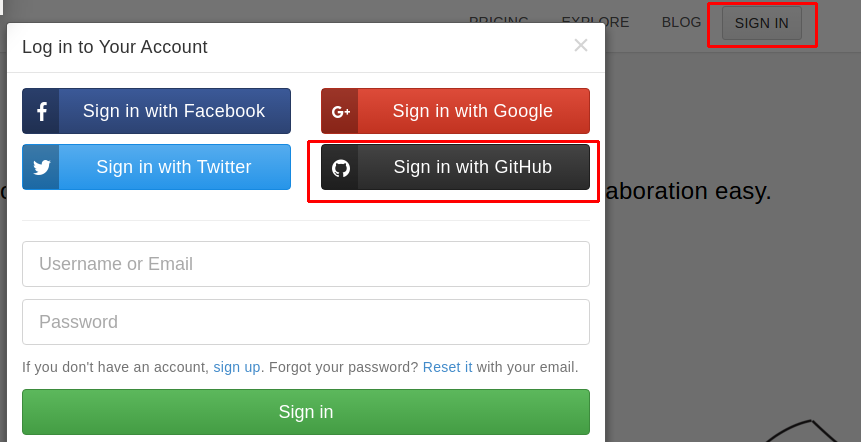
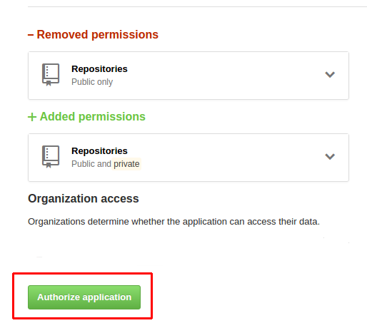
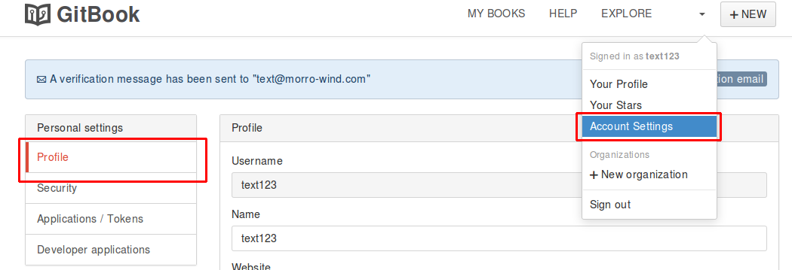
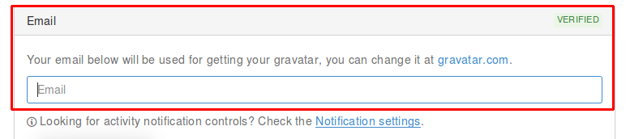

# **1.1. GitBook.com账户注册**
访问gitbook.com，如有GitHub帐号，直接使用GitHub帐号进行授权注册，这里使用GitHub帐号，是因为与GitHub进行关联时无需再次做GitHub授权操作。当然，你也可以注册一个GitBook帐号。
点击登录后，选择使用GitHub帐号登录（图1-1）
图1-1

随后会跳转到GitHub登录页面（图1-2）


图1-2

输入帐号登录后，会跳转到的授权页面（图1-3），图中已有一个存在的授权，是我变更权限时的页面，首次授权的时候是只有一个Added的，而不应该存在```Removed```
图1-3

授权通过后，会跳回GitBook页面，这时点击“帐号设置”选项（图1-4）进行邮箱设置（不设置邮箱是无法创建电子书项目的）图1-5

图1-4

图1-5